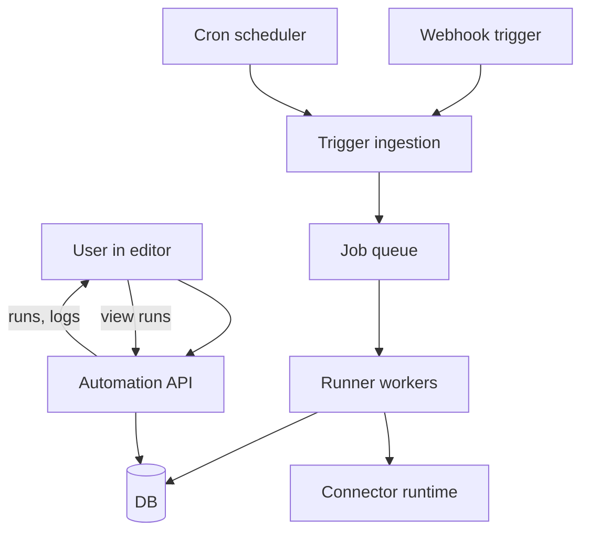

# Automations Platform Rewrite Plan (n8n-like)

This repo’s current automations feature is **UI graph CRUD only** (nodes/edges JSON persisted) with no workflow DSL, runner, triggers, connectors, credential store, or execution history.

Primary existing touchpoints:

- Pages: [`page()`](web/src/app/(protected)/app/automations/page.tsx:1), [`page()`](web/src/app/(protected)/app/automations/create/page.tsx:1), [`page()`](web/src/app/(protected)/app/automations/[id]/edit/page.tsx:1)
- Editor: [`AutomationCanvas()`](web/src/components/automations/automation-canvas.tsx:1), [`AutomationPalette()`](web/src/components/automations/automation-palette.tsx:1)
- API CRUD: [`GET()`](web/src/app/api/workstation/automation/list/[workstationId]/route.ts:1), [`GET()`](web/src/app/api/workstation/automation/load/[workstationId]/[automationId]/route.ts:1), [`POST()`](web/src/app/api/workstation/automation/save/[workstationId]/[automationId]/route.ts:1)
- DB: [`automation`](web/src/server/db/schemas/automation.ts:1), [`workstation`](web/src/server/db/schemas/workstation.ts:1)

---

## 1) Goals (what “works perfectly” means)

### Product goals
- Build and edit **node-based workflows** (n8n-like) with:
  - Webhook trigger, Cron trigger, Manual trigger
  - Control-flow: If, Switch, Merge, Loop/ForEach
  - Data mapping between nodes (expressions)
  - “Run once” test mode with live outputs in the editor
- Run workflows **reliably**:
  - Durable job queue execution
  - Concurrency controls
  - Retries/backoff policies
  - Idempotency for webhook-triggered runs
- Operate workflows:
  - Enable/disable
  - Execution history, per-node logs, inputs/outputs, timings
  - Re-run from failed node / re-run run

### Engineering goals
- A typed workflow DSL + validation + compilation into an executable plan.
- A modular connector system (nodes are backed by executable implementations).
- Secure secrets storage (encrypted at rest).
- Workspace/workstation-scoped tenancy that is consistent across UI + APIs + runtime.

Non-goals for first milestone
- Hundreds of SaaS connectors.
- Complex distributed execution across many machines.

---

## 2) Target architecture (high-level)

### Components
1. **Editor (React)**: graph UI + node configuration panels + run inspector.
2. **Automation API (Next.js route handlers)**: CRUD + publish/version + runs/history.
3. **Compiler**: graph → validated DAG / execution plan.
4. **Runner**: dequeues jobs, executes nodes, persists step state, logs.
5. **Trigger services**:
   - Webhook receiver (HTTP)
   - Cron scheduler
6. **Connector runtime**:
   - Node registry + input schema + execution functions
   - Credential types + auth flows (start with API key + generic OAuth2)
7. **Storage**: DB tables for automations, versions, runs, steps, credentials.

### Mermaid overview

---

## 3) Data model rewrite (Drizzle schemas + migrations)

Current: single `automation` table with `metadata` as text.

Target tables (minimum viable):

### `automation`
- `id`
- `workstationId`
- `name`
- `status` (draft | active | paused | archived)
- `publishedVersion` (nullable int)
- `createdAt`, `updatedAt`

### `automation_version`
- `id`
- `automationId`
- `version` (int, increment)
- `editorGraph` (json) — nodes/edges + UI-specific info
- `definition` (json) — normalized workflow DSL (stable)
- `compiledPlan` (json) — runner plan (DAG, step ids)
- `createdBy`, `createdAt`

### `automation_trigger`
- `id`
- `automationId`
- `version`
- `type` (webhook | cron | manual)
- `config` (json)
- `enabled`
- `webhookPath` (for webhook)
- `nextRunAt` (for cron)

### `automation_run`
- `id`
- `automationId`
- `version`
- `status` (queued | running | succeeded | failed | cancelled)
- `triggerType`
- `triggerEvent` (json)
- `startedAt`, `finishedAt`
- `error` (text/json)

### `automation_run_step`
- `id`
- `runId`
- `nodeId` (stable node instance id from graph)
- `status` (queued | running | succeeded | failed | skipped)
- `attempt`
- `startedAt`, `finishedAt`
- `inputs` (json)
- `outputs` (json)
- `error` (json)

### `connector_credential`
- `id`
- `workstationId`
- `connectorKey` (e.g. http, slack)
- `name`
- `authType` (apiKey | oauth2 | basic)
- `encryptedSecrets` (text)
- `createdAt`, `updatedAt`

Encryption approach
- Reuse pattern similar to existing secrets usage in env (see [`env`](web/src/env.js:1)), introduce an app-level encryption key.
- Store encrypted payload + metadata (iv, tag, version) inside `encryptedSecrets`.

Migration strategy
- One-time migration: read existing `automation.metadata` graph JSON, store as `automation_version.editorGraph` version 1, keep automation in `draft`.

---

## 4) Workflow DSL (what the runner executes)

### Core concepts
- **Node type**: a template like `httpRequest`, `if`, `merge`, `set`, `webhookTrigger`.
- **Node instance**: a node in a workflow with `id`, `type`, `params`, and input connections.
- **Execution context**: shared object holding prior outputs, variables, secrets.

### Definition JSON
- `nodes`: list of node instances with typed `params`
- `connections`: adjacency list specifying which output goes to which input
- `settings`: timeouts, concurrency, error policy

### Expressions + data mapping
- Provide a simple expression engine:
  - access prior outputs: `{{$node.http1.json.body.userId}}`
  - basic JS-like operators and helpers
- MVP: implement expression evaluation on server-side only.

### Validation / compilation
Validation rules:
- Exactly one trigger node for publishable workflows.
- No cycles unless inside a dedicated loop construct.
- Node type + params must match schema.
- Connections must match port types.

Compilation output:
- DAG steps with deterministic step ids
- Precomputed topological order
- Branching rules for If/Switch

---

## 5) Runner + queue design

### Queue choice
- Decide between:
  - DB-backed queue table (simpler deploy)
  - Redis-backed queue (BullMQ) (more scalable)

Given “self-hostable” and existing DB usage, start with **DB-backed queue**:
- `job` table with `status`, `runId`, `availableAt`, `attempts`, `lockedAt`, `lockedBy`.

### Worker process
- A separate Node process under `web/src/server/worker` (or `web/src/server/runner`) started via package scripts.
- Polls jobs, locks rows, executes steps, persists progress.

Execution semantics
- One run executes until:
  - completion
  - error with policy (stop / continue)
  - cancellation
- Persist per-step records so UI can stream/poll.

Idempotency
- For webhook triggers, compute idempotency key from `(automationId, version, webhook event signature)` when present.

Retries/backoff
- Retry policy per node and per run.
- Exponential backoff with max attempts.

---

## 6) Trigger implementation

### Webhook
- New route: `/api/automation/webhook/[workstationId]/[path]` (or a public path with signed token).
- Lookup trigger by `webhookPath`, verify signature (optional shared secret).
- Enqueue `automation_run` + first job.

### Cron
- A scheduler loop in worker:
  - scan enabled cron triggers where `nextRunAt <= now`
  - enqueue run
  - update `nextRunAt`

### Manual
- API endpoint `POST /api/workstation/automation/run-now/...`.

---

## 7) Connector/node system

### Node registry
- A registry mapping `nodeType` → { schema, execute() }.
- Each node declares:
  - input ports / output ports
  - JSON schema for params
  - required credential types

Suggested folder layout
- `web/src/server/automations/nodes/*`
- `web/src/server/automations/registry.ts`

MVP nodes
- Triggers: webhook, cron, manual
- Core: set, merge, if, switch, loop/foreach
- Actions: httpRequest, log

---

## 8) UI rewrite plan (editor + ops)

### Editor
- Keep ReactFlow (already used in [`AutomationCanvas()`](web/src/components/automations/automation-canvas.tsx:1)) but:
  - Introduce typed node renderers
  - Add right panel: node configuration forms generated from node schemas
  - Add data-mapping UI for inputs (expression editor)

### Publish workflow
- Draft editing persists `editorGraph`.
- “Validate & Publish”:
  - calls API to validate/compile
  - writes `automation_version` with definition + compiled plan
  - enables triggers

### Runs UI
- Automation detail page: runs list
- Run detail: per-step timeline
- Step inspector: inputs/outputs/logs

---

## 9) API surface (routes)

Workstation-scoped (consistent with existing routes):
- `GET /api/workstation/automation/list/:workstationId`
- `GET /api/workstation/automation/:workstationId/:automationId` (load draft + published)
- `POST /api/workstation/automation/:workstationId/:automationId/draft` (save editorGraph)
- `POST /api/workstation/automation/:workstationId/:automationId/validate`
- `POST /api/workstation/automation/:workstationId/:automationId/publish`
- `POST /api/workstation/automation/:workstationId/:automationId/enable`
- `POST /api/workstation/automation/:workstationId/:automationId/disable`

Runs:
- `GET /api/workstation/automation/:workstationId/:automationId/runs`
- `GET /api/workstation/automation/:workstationId/runs/:runId`
- `POST /api/workstation/automation/:workstationId/:automationId/run-now`

Credentials:
- `GET/POST/DELETE /api/workstation/credentials/:workstationId`

---

## 10) Incremental delivery plan (do in order)

1. **Stabilize persistence**
   - Introduce `automation_version` and migrate existing metadata into version 1.
   - Fix edit-page behavior to prevent data loss when metadata parse fails.

2. **Define node registry + schemas (server-side)**
   - Implement node definitions for MVP nodes.
   - Implement validation and compilation.

3. **Build runner**
   - DB-backed queue + worker
   - Run + step persistence
   - Basic retry support

4. **Triggers**
   - Webhook ingestion + run creation
   - Cron scheduler

5. **Editor configuration UI**
   - Schema-driven node panels
   - Expression editor + preview outputs

6. **Operations UI**
   - Run history pages
   - Step inspector
   - Enable/disable/publish flows

7. **Credentials + secrets**
   - Encrypted credential storage
   - Connect credential selection in node params

8. **Hardening**
   - Limits (payload sizes, timeouts)
   - Concurrency controls
   - Audit log
   - Tests

---

## 11) Testing strategy

- Unit:
  - DSL validation + compilation
  - Expression evaluation
  - Node execute() for core nodes
- Integration:
  - webhook trigger → run created → steps executed → logs persisted
  - cron trigger scheduling
- UI:
  - editor serialization roundtrip

Leverage existing test patterns (Jest already present under [`web/src/__tests__`](web/src/__tests__/blueprint-sync.test.ts:1)).

---

## 12) Key decisions needed before implementation

1. Queue backend: DB vs Redis/BullMQ.
2. Tenancy model: stay workstation-scoped vs introduce org/members.
3. Expression language: minimal templating vs sandboxed JS.
4. Secrets encryption: single app key vs envelope encryption.

---

## Appendix: Current-state gaps to address immediately

- Today `automation.metadata` is untyped `text` and parse errors can reset the canvas and overwrite on save; guard rails are needed in [`page()`](web/src/app/(protected)/app/automations/[id]/edit/page.tsx:1).
- Palette is static placeholders in [`AutomationPalette()`](web/src/components/automations/automation-palette.tsx:1); replace with registry-driven palette.
