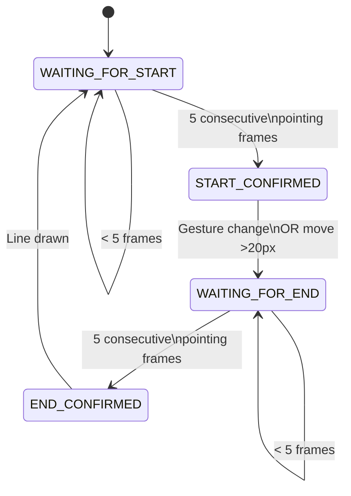

# Architect Drawing Workflow - Quick Reference

## How It Works (User Perspective)

### Drawing a Line

1. **Point at starting position** with index finger
2. **Hold steady for ~167ms** (5 frames @ 30 FPS)
3. **Green circle appears** - start point locked! ✓
4. **Change gesture** (e.g., open palm) OR **move hand away**
5. **Point at ending position** with index finger
6. **Hold steady for ~167ms** (5 frames @ 30 FPS)  
7. **Yellow circle pulses** - confirming...
8. **Line drawn automatically!** ✓

### Visual Indicators

| Indicator | Meaning |
|-----------|---------|
| 🟢 Green circle | Start point confirmed |
| 🟡 Yellow pulsing circle | End point confirming (brightness = progress) |
| ⚪ White preview line | Live preview of final line |
| No indicators | Waiting for first pointing gesture |

---

## Gesture Sequences (All Work!)

### Method 1: Point → Open → Point
```
👆 pointing (5 frames) → ✋ open palm → 👆 pointing (5 frames) → ━━━ line drawn
```

### Method 2: Point → Move → Point  
```
👆 pointing (5 frames) → [move hand 20px+] → 👆 pointing (5 frames) → ━━━ line drawn
```

### Method 3: Point → Remove → Point
```
👆 pointing (5 frames) → [no hand] → 👆 pointing (5 frames) → ━━━ line drawn
```

---

## State Machine (Developer Reference)



### State Descriptions

| State | Description | Exit Condition |
|-------|-------------|----------------|
| `WAITING_FOR_START` | Initial state, looking for first point | 5 pointing frames |
| `START_CONFIRMED` | Start locked, waiting for transition | Gesture change OR move >20px |
| `WAITING_FOR_END` | Looking for end point | 5 pointing frames |
| `END_CONFIRMED` | Both points locked | Immediate (draws line) |

---

## Key Parameters (Tunable)

### Detection
```cpp
required_confirmation_frames_ = 5;        // How many frames to confirm
best_confidence > 0.65f;                 // Minimum detection quality
```

### Smoothing
```cpp
smoothing_window_ = 9;                   // Position averaging window
jitter_threshold_ = 1.5f;                // Minimum movement (pixels)
```

### Transitions
```cpp
dist_from_start > 20.0f;                 // Implicit transition threshold
min_line_length = 2.5f;                  // Minimum drawable line
```

### Rendering
```cpp
current_thickness_ = 3;                  // Line width (pixels)
anti_aliasing_enabled_ = true;           // Smooth lines
subpixel_rendering_ = true;              // Float precision
predictive_smoothing_ = true;            // Velocity prediction
```

---

## Coordinate Flow

```
1. IMX500 Camera
   ↓ (x_cam, y_cam)
   
2. Hand Detector
   ↓ fingertip[0] or center
   
3. Smoothing Buffer (9 frames)
   ↓ exponential weighted average
   
4. Predictive Filter (optional)
   ↓ velocity-based prediction
   
5. Projector Calibration (optional)
   ↓ homography transform
   
6. Final Position (float precision)
   ↓ (x_display, y_display)
   
7. Anti-Aliased Rendering
   ↓ Xiaolin Wu algorithm
   
8. Framebuffer → Projector
```

---

## Error Handling

### Line Too Short
```
Distance < 2.5px → Discarded
Logs: "✗ Line too short (1.8px), discarded"
```

### Low Confidence
```
Confidence < 0.65 → Ignored
No frame counted toward confirmation
```

### Gesture Instability
```
Gesture changes mid-confirmation → Reset counter
Logs: (silent reset, waits for stable gesture)
```

---

## Performance Monitoring

### Frame Timing (30 FPS)
```
Frame 1-4:   Pointing detected, counting...
Frame 5:     ✓ START CONFIRMED
Frame 6-10:  Gesture changed, waiting...
Frame 11-14: Pointing detected, counting...
Frame 15:    ✓ END CONFIRMED → Line drawn
```

### Total Latency
- **Minimum**: 334ms (5 frames × 2 confirmations × 33.3ms)
- **Typical**: 400-500ms (with gesture transition)
- **Maximum**: No limit (user controls pace)

---

## Calibration Workflow

### 1. Setup Calibration Pattern
```cpp
// Project 4 corner markers
Point display_corners[4] = {
    {100, 100},    {1820, 100},    // Top-left, Top-right
    {100, 980},    {1820, 980}     // Bottom-left, Bottom-right
};
```

### 2. Measure Camera Coordinates
```cpp
// Where camera sees the markers
Point camera_corners[4] = {
    {50, 60},      {590, 55},      // Distorted by perspective
    {45, 425},     {595, 420}
};
```

### 3. Apply Calibration
```cpp
sketchpad.set_calibration_points(camera_corners, display_corners);
sketchpad.calibrate_projector();
sketchpad.enable_projector_calibration(true);
```

### 4. Verify
```
Point test = {320, 240};  // Camera center
Point mapped = sketchpad.apply_calibration(test);
// Should map to ~(960, 540) on 1920x1080 display
```

---

## Debug Output Example

```
[SketchPad] ┌─────────────────────────────────────────────────┐
[SketchPad] │  ENTERPRISE DRAWING SYSTEM - ARCHITECT MODE   │
[SketchPad] └─────────────────────────────────────────────────┘
[SketchPad] Initialized: 'blueprint_floor_2'
  • Resolution: 1920x1080
  • Confirmation frames: 5
  • Anti-aliasing: ENABLED
  • Sub-pixel rendering: ENABLED
  • Predictive smoothing: ENABLED
  • Projector calibration: DISABLED
  • Jitter threshold: 1.5px (sub-pixel precision)

[SketchPad] ✓ START confirmed at (  456.7,  789.2) after 5 frames (conf: 89%)
[SketchPad] → Gesture changed, waiting for END point...
[SketchPad] ✓ END confirmed at ( 1234.5,  234.8) after 5 frames (conf: 92%)
[SketchPad] ✓ Line #   1 created: ( 456.7, 789.2) → (1234.5, 234.8) length:  901.3px
```

---

## Common Issues & Solutions

### Issue: Lines not appearing
**Cause**: Confirmation frames too high or confidence too low  
**Solution**: Lower `required_confirmation_frames_` or confidence threshold

### Issue: Jittery start/end points
**Cause**: Smoothing window too small  
**Solution**: Increase `smoothing_window_` (try 11 or 13)

### Issue: Can't trigger end point
**Cause**: Not enough movement from start  
**Solution**: Ensure >20px movement or explicit gesture change

### Issue: Accidental lines
**Cause**: Confirmation frames too low  
**Solution**: Increase to 7-10 frames for more deliberate drawing

### Issue: Laggy response
**Cause**: Frame rate too low or predictive smoothing too aggressive  
**Solution**: Reduce `smoothing_window_` or disable predictive smoothing

---

## Best Practices for Architects

### 1. Lighting
- Consistent ambient lighting (avoid shadows)
- No direct light on hands (causes washout)
- Matte table surface (reduces glare)

### 2. Hand Position
- Keep hand flat, parallel to table
- Extend index finger clearly
- Minimize wrist rotation during confirmation

### 3. Drawing Technique
- **Slow and deliberate** for confirmation
- **Quick transitions** between start/end
- **Consistent pointing** (don't wiggle finger)

### 4. Projector Setup
- Mount overhead, perpendicular to table
- Focus sharply (crisp edges)
- Brightness sufficient but not blinding
- Calibrate before each session

### 5. Workflow Optimization
- Draw major lines first (skeleton)
- Add details second (refinements)
- Save frequently (`s` key)
- Use `c` to clear and restart

---

## File Operations

### Save Drawing
```cpp
sketchpad.save("blueprint_v1");
// Creates: blueprint_v1.jarvis (JSON format)
```

### Load Drawing
```cpp
sketchpad.load("blueprint_v1");
// Reads: blueprint_v1.jarvis
```

### File Format
```json
{
  "name": "blueprint_v1",
  "width": 1920,
  "height": 1080,
  "created_timestamp": 1700332800000,
  "lines": [
    {
      "start": {"x": 456.7, "y": 789.2},
      "end": {"x": 1234.5, "y": 234.8},
      "color": 16777215,
      "thickness": 3,
      "timestamp": 1700332801234
    }
  ]
}
```

---

## Summary

🎯 **For Users**: Point (hold) → Change → Point (hold) → Line appears  
🔧 **For Developers**: 5-frame confirmation with exponential smoothing  
🏗️ **For Architects**: Sub-pixel precision, anti-aliased, projector-ready  

**Total drawing time per line**: ~0.5 seconds (fast enough, stable enough)
