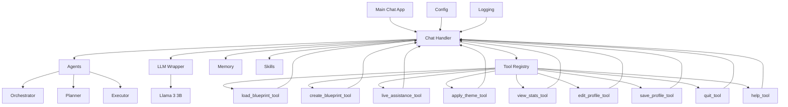

# Tool-Based Chat-Driven Architecture for Hardware App

## Overview
Replace the Textual TUI with a chat-driven system where users interact via natural language, and an AI agent interprets commands to execute tools that perform the hardware control functionalities.

## Current TUI Functionalities Identified
- **Main Menu:**
  - Load Blueprint
  - Create Blueprint
  - Live Assistance
  - Settings
  - Smart Mode (AI Chat)
  - Quit

- **Settings:**
  - Apply Theme (customize colors)
  - View System Stats
  - Edit Profile

- **Profile:**
  - Save Profile (name, email)

- **Smart Mode:**
  - Chat with Llama 3 3B AI

## New Architecture Design

### Root Level
- `config/`: Configuration files and settings
- `logging/`: Logging utilities and configurations

### Core Components (core/ folder)
- `agents/`: Different types of AI agents
  - `orchestrator.py`: Coordinates overall workflow
  - `planner.py`: Plans complex tasks
  - `executor.py`: Executes simple commands
- `llm/`: LLM wrappers for different models
  - `gemma_wrapper.py`: Wrapper for Gemma 3 1B via Ollama
  - (future: other LLM wrappers)
- `memory/`: Memory management for conversation history and state
- `skills/`: Higher-level behaviors and composite tools
- `chat_handler.py`: Manages the chat interface, sends user messages to AI, handles tool calls
- `tool_registry.py`: Registers and manages available tools

### Tools (tools/ folder)
Each tool is a module implementing a specific functionality, callable by the AI agent.

- `load_blueprint_tool.py`: Tool to load and apply blueprints
- `create_blueprint_tool.py`: Tool to create new blueprints
- `live_assistance_tool.py`: Tool to activate live assistance mode
- `apply_theme_tool.py`: Tool to change UI theme colors
- `view_stats_tool.py`: Tool to display system statistics
- `edit_profile_tool.py`: Tool to update user profile
- `save_profile_tool.py`: Tool to save profile changes
- `quit_tool.py`: Tool to exit the application
- `help_tool.py`: Tool to list available tools and their usage

### Chat Flow
1. User inputs message in chat
2. Chat Handler sends to AI with tool descriptions
3. AI decides if to call a tool and with what parameters
4. Tool executes and returns result
5. Chat Handler displays result to user

## Architecture Diagram

## Implementation Plan
1. Create core/ and tools/ directories
2. Implement base tool interface
3. Implement each tool as stub (placeholder functionality)
4. Implement core components
5. Create new chat-driven main app
6. Integrate with existing config and logging

## Benefits
- Natural language interaction instead of menu navigation
- Extensible: easy to add new tools
- AI-powered: can handle complex queries and combine tools
- Maintains all existing functionalities