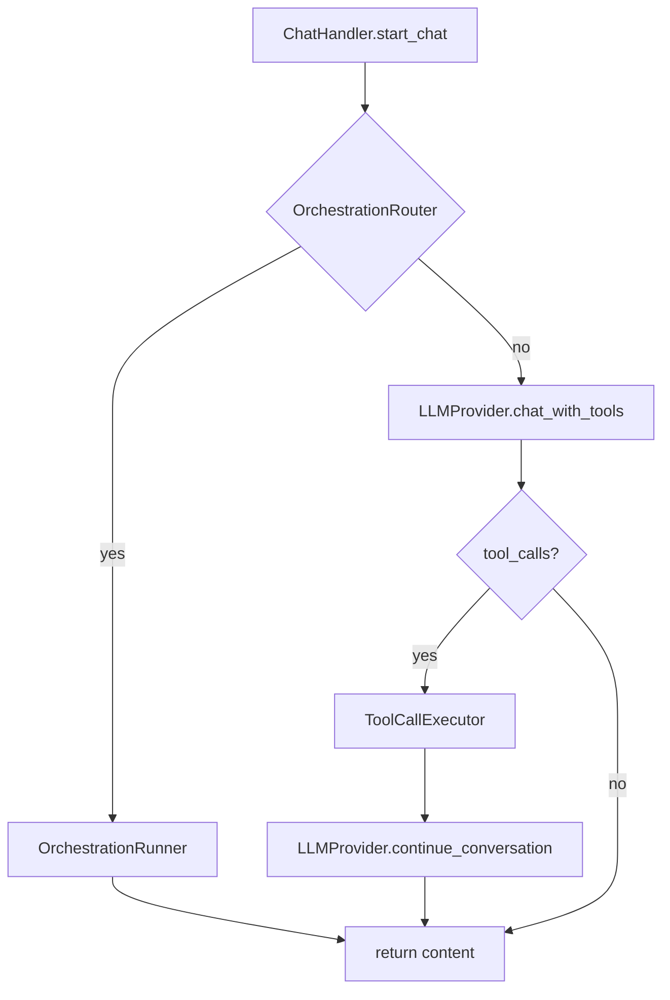

# Minimal refactor plan: ChatHandler responsibilities (Problem #2)

## Goal
Reduce responsibilities inside [`hardware/core/chat_handler.py`](hardware/core/chat_handler.py) without changing the entrypoint in [`hardware/app.py`](hardware/app.py) and without changing the public API used by tests (notably `ChatHandler.process_message()` and `ChatHandler.execute_tool_call()`).

Primary objectives:
- Extract tool-call parsing/execution into a helper component.
- Extract orchestrator routing and orchestrator execution into a helper component.
- Keep `ChatHandler.start_chat()` in place (minimal scope), but make it a thin coordinator.

Non-goals for this pass:
- No conversion to a fully-async CLI loop.
- No changes to app startup wiring.
- No large-scale import-root cleanup (core.* vs hardware.core.*), unless required for the new modules.

---

## Proposed module boundaries

### 1) Tool execution helper
Create a new helper module:
- [`hardware/core/tool_execution.py`](hardware/core/tool_execution.py)

Responsibilities:
- Parse tool call payloads from LLM.
- Decode JSON arguments (optionally using `orjson`).
- Lookup tools in [`hardware/core/tool_registry.py`](hardware/core/tool_registry.py).
- Execute tool safely and return a string result.

Public surface:
- `class ToolCallExecutor:`
  - `__init__(self, registry: ToolRegistry, logger: Logger | None = None)`
  - `execute_tool_call(self, tool_call: dict[str, Any]) -> str`

Notes:
- Keep behavior-compatible error strings (tests assert substring `Error executing tool`). See [`hardware/tests/test_chat_handler.py`](hardware/tests/test_chat_handler.py).
- Leave schema validation out for this pass (would change behavior); optionally add a TODO comment.

### 2) Orchestration routing/execution helper
Create a new helper module:
- [`hardware/core/orchestration.py`](hardware/core/orchestration.py)

Responsibilities:
- Decide whether to use orchestrator (keyword/length heuristics remain unchanged).
- Execute orchestrator workflow and apply the footer metadata formatting.

Public surface:
- `ORCHESTRATION_KEYWORDS` moved here (or imported by both).
- `class OrchestrationRouter:`
  - `__init__(self, orchestrator: OrchestratorAgent | None)`
  - `should_use_orchestrator(self, message: str) -> bool`
- `class OrchestrationRunner:`
  - `__init__(self, orchestrator: OrchestratorAgent, memory_manager: UnifiedMemoryManager | None, logger: Logger)`
  - `async def run(self, message: str) -> str`

Notes:
- Preserve the existing footer format and memory event recording logic from [`hardware/core/chat_handler.py`](hardware/core/chat_handler.py).

---

## Changes to ChatHandler
Update [`hardware/core/chat_handler.py`](hardware/core/chat_handler.py):

1) Construction:
- Instantiate `self._tool_executor = ToolCallExecutor(self.tool_registry, logger)`.
- Instantiate `self._orchestration_router = OrchestrationRouter(self._orchestrator)`.
- Instantiate `self._orchestration_runner` only if orchestrator exists.

2) Delegation:
- Replace body of `execute_tool_call()` with `return self._tool_executor.execute_tool_call(tool_call)`.
- Replace `_should_use_orchestrator()` with `return self._orchestration_router.should_use_orchestrator(message)`.
- Replace `_process_with_orchestrator()` body with call to `await self._orchestration_runner.run(message)`.

3) Keep API stable:
- Keep method names and signatures unchanged.
- Keep error string formats compatible.

---

## Tests impact
Update or keep green:
- [`hardware/tests/test_chat_handler.py`](hardware/tests/test_chat_handler.py)

Expected impact:
- No behavior changes for the tested surfaces.
- Potentially add focused unit tests for the new helpers:
  - `hardware/tests/test_tool_execution.py`
  - `hardware/tests/test_orchestration.py`

But for minimal scope, helper tests are optional if existing tests cover behavior.

---

## Mermaid overview

---

## Implementation notes / migration risks
- The codebase currently imports `core.*` in multiple places (see [`hardware/core/chat_handler.py`](hardware/core/chat_handler.py) and [`hardware/app.py`](hardware/app.py)). New modules should follow the same convention to avoid introducing mismatched import styles in the same package.
- If we later fix import roots, do it as a separate change to keep this refactor reviewable.

---

## Success criteria
- `pytest` passes, especially [`hardware/tests/test_chat_handler.py`](hardware/tests/test_chat_handler.py).
- No changes required to [`hardware/app.py`](hardware/app.py).
- `ChatHandler` file shrinks meaningfully and delegates responsibilities cleanly.
