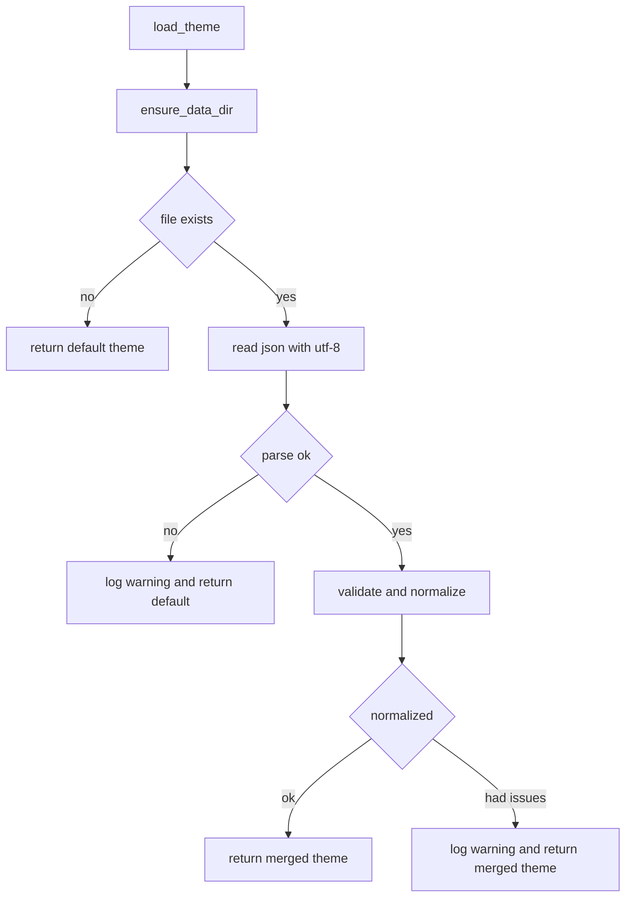

# Data utils IO hardening plan (critique #8)

Target: make IO in [`hardware/core/data_utils.py`](hardware/core/data_utils.py:1) more correct and observable without breaking current callers.

## Current issues (observed)

In [`hardware/core/data_utils.py`](hardware/core/data_utils.py:1):

- File IO is implicit/default encoding via `open(..., "r")` and `open(..., "w")`, which can vary by platform and can corrupt non-ASCII data.
- Writes are non-atomic (`json.dump` directly to the target file), so partial/corrupt files can occur on crash/interruption.
- Load functions swallow parse and IO errors (`except ...: pass`), causing silent fallback and making incidents hard to diagnose.
- Loaded JSON is not validated. Callers get whatever is in the JSON file, even if types/keys are wrong.

## Goals and non-goals

### Goals

- Correctness: deterministic encoding, safer writes, basic schema validation.
- Observability: log when fallback behavior occurs and why.
- Compatibility: preserve existing public function names, signatures, and return shapes.

### Non-goals

- No format migration or backward-incompatible schema change.
- No changes to callers in this task.
- No external dependencies.

## Proposed changes (design)

### 1) Explicit UTF-8 encoding

- Use `open(path, mode, encoding='utf-8')` consistently for reads and writes.
- When writing JSON, include `ensure_ascii=False` so UTF-8 content is preserved as text.

Notes:

- Keep `indent=2` to avoid churn; optionally set `sort_keys=True` if stable output is desirable.

### 2) Atomic writes for JSON

Implement an internal helper that writes to a temporary file in the same directory then swaps into place.

Approach:

- Ensure directory exists via existing [`ensure_data_dir()`](hardware/core/data_utils.py:14).
- Write to a temp file: `theme.json.tmp` or `theme.json.<pid>.tmp` in `DATA_DIR`.
- `flush()` and `os.fsync()` the temp file descriptor to reduce risk of data loss.
- Replace target with `os.replace(temp_path, target_path)` for atomic swap (Windows compatible).
- Best-effort cleanup of temp file on failure.

Why:

- Prevents partial writes producing invalid JSON.
- Provides deterministic behavior on crash: either old file or fully written new file.

### 3) Add standard logging for failures and fallback

- Add module-level logger: `logger = logging.getLogger(__name__)`.
- Log at `warning` when load fails and the function returns fallback/default values.
- Log at `exception` when an unexpected exception occurs (captures stack trace) or use `warning(..., exc_info=True)` for expected failures.

Events to log (minimum):

- Read failure: file exists but cannot be read (permissions, IO error).
- Parse failure: JSON invalid.
- Validation failure: JSON parsed but has wrong type or missing critical keys.
- Write failure: cannot write temp file or cannot replace.

Content to include in log record:

- Target file path (theme/profile).
- High-level reason category: `io_error`, `json_decode_error`, `validation_error`.
- Exception detail (via `exc_info=True`).

Compatibility note:

- Logging is additive and should not change control flow. Default Python logging config is no-op unless configured by app.

### 4) Basic validation of loaded JSON while keeping compatibility

Add minimal schema validation with normalization rather than strict rejection, to avoid breaking callers.

#### Theme validation

Expectation from signature: `dict[str, str]`.

Validation rules:

- Loaded value must be a `dict`; otherwise invalid.
- Keys and values must be `str`. Non-string values are invalid.
- Restrict keys to known theme keys currently in DEFAULT_THEME in [`load_theme()`](hardware/core/data_utils.py:19) to avoid propagating junk.

Normalization strategy:

- Start from `DEFAULT_THEME.copy()`.
- If loaded dict has valid string values for known keys, override defaults.
- Ignore unknown keys.
- If loaded dict exists but is only partially valid, return merged result and log at `warning` that normalization occurred.

Rationale:

- Callers always get all expected theme keys.
- A corrupted or incomplete file no longer causes silent defaulting without signal.

#### Profile validation

Current return shape: `{"name": "", "email": ""}` in [`load_profile()`](hardware/core/data_utils.py:50).

Validation rules:

- Loaded value must be a `dict`; otherwise invalid.
- `name` and `email` should be strings; if missing or wrong type, coerce to empty string.
- Ignore unknown keys to keep payload minimal.

Normalization strategy:

- Return `{ "name": <str>, "email": <str> }` always.
- If normalization happens or invalid types are found, log a warning.

Compatibility note:

- Callers currently may receive extra keys if the JSON file had them. This plan proposes *dropping* unknown keys to avoid uncontrolled data flow. If that is considered a compatibility risk, instead preserve unknown keys but only validate/coerce `name` and `email`.

### 5) Preserve public API for current callers

- Keep these signatures unchanged:
  - [`load_theme()`](hardware/core/data_utils.py:19) returns `dict[str, str]`
  - [`save_theme(theme)`](hardware/core/data_utils.py:43)
  - [`load_profile()`](hardware/core/data_utils.py:50) returns `dict[str, str]`
  - [`save_profile(profile)`](hardware/core/data_utils.py:63)

Behavioral compatibility principles:

- `load_*` continues to return a valid dict even if the file is missing/bad.
- `save_*` continues to accept dict-like payloads; if invalid data is passed, decide between:
  - permissive: attempt to serialize best-effort and log if types unexpected
  - strict: raise `TypeError` early

To avoid breaking callers, start permissive but add validation + warning logs for unexpected types.

## Suggested internal structure changes (still no public API change)

- Add internal helpers in [`hardware/core/data_utils.py`](hardware/core/data_utils.py:1):
  - `_read_json_file(path) -> object | None` that returns parsed JSON or `None` and logs on failure.
  - `_atomic_write_json(path, data) -> None`.
  - `_validate_theme(obj) -> dict[str, str]` returning normalized theme.
  - `_validate_profile(obj) -> dict[str, str]` returning normalized profile.

Then implement `load_theme` and `load_profile` as:

- Ensure dir
- Read JSON (if exists)
- Validate/normalize
- Return fallback if no file or unrecoverable failure (but with logs)

## Testing plan (high value, minimal)

Add unit tests around IO behavior and validation.

Test cases:

- Encoding:
  - Save then load a profile with non-ASCII characters and assert round-trip works.
- Atomic write semantics:
  - Simulate interrupted write by forcing exception between write and replace, confirm original file remains valid.
  - Ensure `os.replace` is used (can be asserted via mocking).
- Parse failures are observable:
  - Create invalid JSON file and assert `load_*` returns fallback/normalized values and logs a warning.
- Validation behavior:
  - Theme missing keys returns defaults for missing keys.
  - Theme with wrong types is normalized and logs.
  - Profile missing name or email returns empty strings.

If there is an existing test framework location, place tests accordingly; otherwise introduce a small `tests/` module for hardware utilities.

## Rollout and safety

- Implement behind the scenes with identical function signatures.
- Keep fallback behavior but make it observable via logging.
- Ensure atomic writes do not change file paths or directory assumptions.

## Open decision points

- Unknown keys behavior in profile/theme files:
  - drop unknown keys for strictness
  - preserve unknown keys to avoid compatibility risk
- Strictness for `save_*` input validation:
  - warn and coerce or raise error

Mermaid overview:

