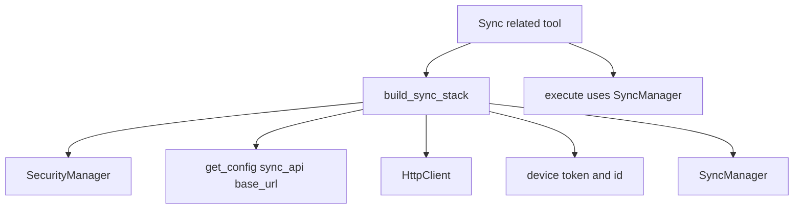

# Fix 6 Plan: Factor common sync initialization into shared helper

## Goals (scope limited)
- Reduce duplication across sync-related tools by factoring shared initialization into a single helper:
  - `SecurityManager()`
  - config-driven `sync_api.base_url`
  - `HttpClient(base_url, security_manager)`
  - device token + device id
  - `SyncManager(http_client, device_token, device_id)`
- Update target tools to use the helper:
  - [`SyncTool`](hardware/tools/sync_tool.py:13)
  - [`SendBlueprintTool`](hardware/tools/send_blueprint_tool.py:14)
  - [`UpdateBlueprintTool`](hardware/tools/update_blueprint_tool.py:13)
  - [`ResolveConflictTool`](hardware/tools/resolve_conflict_tool.py:13)
  - [`SyncQueueTool`](hardware/tools/sync_queue_tool.py:14)
- Add tests that:
  1) ensure each tool uses the helper (monkeypatch helper and assert called)
  2) preserve behavior (tool instance has expected attributes; existing execute-path behavior not regressed)

---

## (1) Helper location
Create a new module under core sync:
- New file: [`hardware/core/sync/sync_factory.py`](hardware/core/sync/sync_factory.py:1)

Rationale:
- The helper is not tool-specific; it is “sync stack” construction.
- Tools can import consistently via `from core.sync.sync_factory import build_sync_stack`.
- Tests can monkeypatch a single import path (`core.sync.sync_factory.build_sync_stack`).

---

## (2) Helper API: exact signature + returns

### Proposed types
Add a small dataclass to make the return value explicit and self-documenting.

**In** [`hardware/core/sync/sync_factory.py`](hardware/core/sync/sync_factory.py:1):

- `@dataclass(frozen=True)`
  - `class SyncStack:`
    - `security: SecurityManager`
    - `http_client: HttpClient`
    - `device_token: str`
    - `device_id: str`
    - `sync_manager: SyncManager`

### Helper function
- `def build_sync_stack(*, security: SecurityManager | None = None, base_url: str | None = None) -> SyncStack:`

Behavior:
1) Determine `SecurityManager`:
   - If `security` provided, use it.
   - Else create `SecurityManager()`.
2) Determine `base_url`:
   - If `base_url` provided, use it.
   - Else `cfg = get_config()` and `base_url = cfg.sync_api.base_url`.
3) Construct HTTP client:
   - `http_client = HttpClient(base_url=base_url, security_manager=security)`
4) Load device credentials:
   - `device_token = security.load_device_token()`
   - `device_id = security.load_device_id()`
5) Construct sync manager:
   - `sync_manager = SyncManager(http_client, device_token, device_id)`
6) Return `SyncStack(...)`.

Notes:
- The optional `security` and `base_url` parameters are primarily for testability and future extension.
- This helper intentionally does **not** cache instances; it mirrors the current per-tool construction.

---

## (3) Tool edits to use helper

General pattern for all target tools:
- Remove duplicated imports:
  - remove `get_config`, `HttpClient`, `SecurityManager`, `SyncManager` imports from tool modules
- Add import:
  - `from core.sync.sync_factory import build_sync_stack`
- Replace the duplicated init block in `__init__` with:
  - `stack = build_sync_stack()`
  - assign attributes to preserve current public surface:
    - `self.security = stack.security`
    - `self.http_client = stack.http_client`
    - `self.device_token = stack.device_token`
    - `self.device_id = stack.device_id`
    - `self.sync_manager = stack.sync_manager`

### Per-tool changes

#### A) [`SyncTool`](hardware/tools/sync_tool.py:13)
- Replace lines in `__init__` currently creating security/http/device/sync_manager with `build_sync_stack()` assignments.
- No behavior change expected.

#### B) [`SendBlueprintTool`](hardware/tools/send_blueprint_tool.py:14)
- Same refactor in `__init__`.
- Keep `_find_blueprint_path()` intact.

#### C) [`UpdateBlueprintTool`](hardware/tools/update_blueprint_tool.py:13)
- Same refactor in `__init__`.

#### D) [`ResolveConflictTool`](hardware/tools/resolve_conflict_tool.py:13)
- Same refactor in `__init__`.

#### E) [`SyncQueueTool`](hardware/tools/sync_queue_tool.py:14)
- Same refactor in `__init__`.
- Ensure `self.queue = OfflineQueue()` remains as-is after the stack init (or before; either is fine).

Non-goal:
- Do not refactor [`SyncStatusTool`](hardware/tools/sync_status_tool.py:11) in this fix; it doesn’t build `HttpClient`/`SyncManager`.

---

## (4) Tests to add

Create a new focused test module:
- New file: [`hardware/tests/test_sync_factory_usage.py`](hardware/tests/test_sync_factory_usage.py:1)

### Testing strategy
We want two complementary assurances:

1) **Helper usage** per tool
- Monkeypatch `core.sync.sync_factory.build_sync_stack` to a stub that records calls and returns a deterministic `SyncStack`.
- Instantiate each tool class and assert:
  - stub was called exactly once
  - tool attributes (`security`, `http_client`, `device_token`, `device_id`, `sync_manager`) come from the returned stack

Key detail for monkeypatching:
- Patch the name **as imported by the tool module**, not only the factory module, because the tool will likely do `from core.sync.sync_factory import build_sync_stack`.
- Therefore, patch these import sites:
  - [`hardware/tools/sync_tool.py`](hardware/tools/sync_tool.py:1) module attribute `build_sync_stack`
  - [`hardware/tools/send_blueprint_tool.py`](hardware/tools/send_blueprint_tool.py:1) module attribute `build_sync_stack`
  - [`hardware/tools/update_blueprint_tool.py`](hardware/tools/update_blueprint_tool.py:1) module attribute `build_sync_stack`
  - [`hardware/tools/resolve_conflict_tool.py`](hardware/tools/resolve_conflict_tool.py:1) module attribute `build_sync_stack`
  - [`hardware/tools/sync_queue_tool.py`](hardware/tools/sync_queue_tool.py:1) module attribute `build_sync_stack`

This ensures the test fails if a tool bypasses the helper.

2) **Behavior preserved**
Two lightweight checks:
- Construction surface:
  - after tool instantiation, `tool.sync_manager` exists and is the stubbed sync_manager
  - for [`SyncQueueTool`](hardware/tools/sync_queue_tool.py:14), `tool.queue` still exists (instance of `OfflineQueue`)

Optional additional regression check (still within scope, but slightly more effort):
- For one representative tool (e.g. [`SyncTool`](hardware/tools/sync_tool.py:13)), patch `tool.sync_manager.sync_to_server` to an async stub returning `[]` and assert `execute()` returns `ToolResult.ok_result` with `Synced 0 blueprints`.
  - This validates the refactor did not change the `execute` flow.

### Suggested test cases (exact)
- `test_sync_tool_uses_build_sync_stack(monkeypatch)`
- `test_send_blueprint_tool_uses_build_sync_stack(monkeypatch)`
- `test_update_blueprint_tool_uses_build_sync_stack(monkeypatch)`
- `test_resolve_conflict_tool_uses_build_sync_stack(monkeypatch)`
- `test_sync_queue_tool_uses_build_sync_stack_and_keeps_queue(monkeypatch)`
- `test_sync_tool_execute_behavior_preserved_with_stubbed_sync_manager(monkeypatch)` (optional but recommended)

Implementation detail: create simple sentinel objects
- `security = object()` is fine unless code assumes methods; but tools only store it.
- For `device_token/device_id`, use strings.
- For `sync_manager`, either:
  - a simple object with the needed async method for the execute regression test
  - or a `types.SimpleNamespace(...)`.

---

## (5) Pytest commands
Run only the new/affected tests:
- `pytest -q hardware/tests/test_sync_factory_usage.py`

Run full test suite for safety:
- `pytest -q`

If you want verbose output for failures:
- `pytest -q -vv hardware/tests/test_sync_factory_usage.py`

---

## Mermaid overview

---

## Implementation todo (for Code mode)
- [ ] Add [`hardware/core/sync/sync_factory.py`](hardware/core/sync/sync_factory.py:1) with `SyncStack` + `build_sync_stack`.
- [ ] Update [`SyncTool`](hardware/tools/sync_tool.py:13) to use `build_sync_stack`.
- [ ] Update [`SendBlueprintTool`](hardware/tools/send_blueprint_tool.py:14) to use `build_sync_stack`.
- [ ] Update [`UpdateBlueprintTool`](hardware/tools/update_blueprint_tool.py:13) to use `build_sync_stack`.
- [ ] Update [`ResolveConflictTool`](hardware/tools/resolve_conflict_tool.py:13) to use `build_sync_stack`.
- [ ] Update [`SyncQueueTool`](hardware/tools/sync_queue_tool.py:14) to use `build_sync_stack`.
- [ ] Add [`hardware/tests/test_sync_factory_usage.py`](hardware/tests/test_sync_factory_usage.py:1) per above.
- [ ] Run pytest commands listed above.
