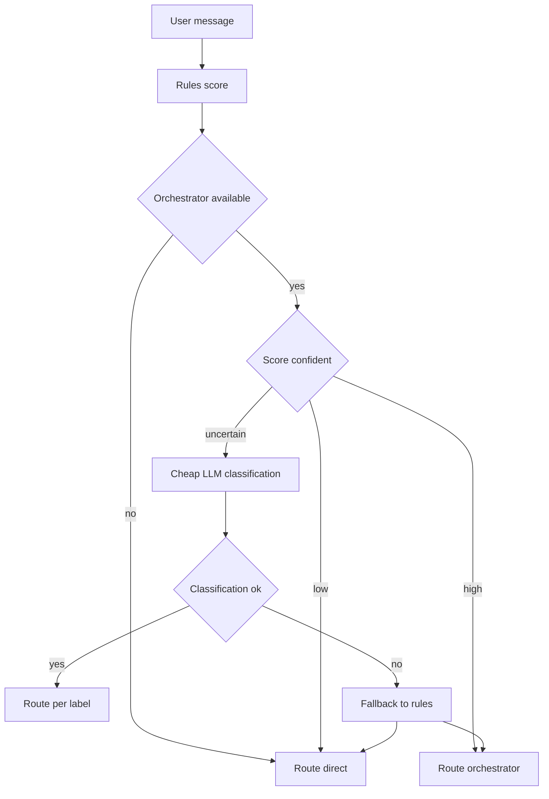

# Hybrid orchestration routing improvement (critique #9)

Goal: improve routing to multi-agent orchestration while keeping behavior/backward compatibility as much as reasonable.

We will:
1) Replace the current boolean keyword/length heuristics with an explainable *rules score* (still fully local/cheap).
2) If the score is confidently low/high, route based on rules.
3) If the score is *uncertain*, perform a **cheap LLM classification** call (no tool calling) to decide whether to route to orchestrator.
4) Integrate into existing structure: [`hardware/core/orchestration.py`](hardware/core/orchestration.py:1) provides routing logic; [`hardware/core/chat_handler.py`](hardware/core/chat_handler.py:1) continues to call router from `start_chat()` and retains the existing runner + fallback.

---

## Current behavior (baseline)

From [`OrchestrationRouter.should_use_orchestrator()`](hardware/core/orchestration.py:56):
- If no orchestrator instance: returns False.
- Else returns True if:
  - any substring in `ORCHESTRATION_KEYWORDS` exists in message (case-insensitive)
  - OR message length > 200
  - OR punctuation density: at least 3 periods or 4 commas

From [`ChatHandler.start_chat()`](hardware/core/chat_handler.py:116):
- Uses `_should_use_orchestrator()` to decide between `self._process_with_orchestrator()` vs `self.process_message()`.

Key constraint: routing currently does *not* depend on LLM availability; it is deterministic and cheap.

---

## Proposed approach

### A. Rules-first scoring (improved, still cheap)

Add a score-based decision that is more robust than substring matching.

#### A1. Compile patterns with word boundaries

Problem: substring matching causes false positives (eg `create` matching `recreate`, `plan` matching `planet`).

Solution:
- Use regex patterns with word boundaries for single tokens.
- Keep phrase matching for multi-word phrases (eg `write code`, `make a`, `help me`) using `\b` boundaries around each token or by using `(?:^|\W)` style anchors.

Implementation detail (in router):
- Precompile a list of weighted regex patterns at module import time.
- Use `re.IGNORECASE`.

#### A2. Weighted feature groups

Compute a numeric `score` from multiple signals:

1) **Explicit build/change intent** (high weight)
   - verbs like: create/build/implement/develop/design/refactor/debug/fix/optimize
   - phrases: write code, make a, build a, implement a

2) **Project/system language** (medium)
   - blueprint, architecture, system, project, pipeline, agent, tool, repository

3) **Complexity signals** (medium)
   - length, list-like structures, multiple clauses
   - punctuation counts (periods/commas) but normalized by length
   - presence of enumerations: lines starting with `-`, `*`, `1.`, `2.`

4) **Tooling / execution triggers** (medium-high)
   - mentions of repo structure, filenames, errors, stack traces
   - regex examples:
     - `\b(traceback|stack trace|exception|error|fails?)\b`
     - `\b(test|pytest|npm|pip|docker|kubernetes|git)\b`
     - file extensions: `\.(py|ts|js|java|go|rs|md|yaml|yml|json)\b`

5) **Downgrade / chatty intent** (negative weight)
   - simple questions unlikely to need orchestration: “what is”, “define”, “explain”, “translate”, “summarize”
   - short messages that are purely conversational

Notes:
- We should keep the existing keyword list as input seeds to avoid behavior drift, but use better matching + weights.
- Keep the old hard thresholds as *implicit* high-confidence boosts so that backward compatibility remains.

#### A3. Deterministic output: decision + confidence

Expose a richer evaluation:
- `score: float`
- `decision: bool` (route to orchestrator?)
- `reason: dict` (top matched features for logging)
- `is_uncertain: bool`

Backwards compatibility approach:
- `should_use_orchestrator(message: str) -> bool` remains as a wrapper around the new evaluation and returns only the boolean.
- Add a new method eg `evaluate(message: str) -> RoutingDecision`.

Suggested scoring bands (tunable constants):
- `score >= +3.0` => **definitely orchestrator**
- `score <= +0.5` => **definitely direct LLM**
- else => **uncertain**

Also preserve prior heuristics by ensuring:
- `len(message) > 200` adds a large boost (eg +3) so it stays in “definitely orchestrator”.
- punctuation threshold (3 periods or 4 commas) adds a medium boost (eg +2).

---

### B. Cheap LLM classification when uncertain

When `is_uncertain` is True, call a cheap classification prompt to decide.

#### B1. Classification contract

Inputs:
- user message (optionally truncated to safe length like 800 chars)
- optionally the computed `score` and key signals (for LLM transparency; but keep prompt small)

Output:
- strict label, JSON preferred:
  - `route_to_orchestrator: true|false`
  - `confidence: 0..1`
  - `reason: short string`

Decision rules:
- If parse fails, fall back to rules-only decision (to preserve reliability).
- If LLM is unavailable or errors, fall back to rules-only decision.

#### B2. Prompt (cheap, constrained)

System:
- You are a router. Decide if this user request requires multi-step planning, coordination across tools/agents, code changes, debugging, or project-level work.
- Return ONLY JSON with the keys above.

User:
- Message: <message>
- Routing guidance: route_to_orchestrator=true if the request likely benefits from multi-step decomposition, tool execution, or changes across multiple files. Otherwise false.

Safety/perf:
- Disable tool calling for this classification (it should be a plain chat completion).
- Use low max tokens (eg 80-120).
- Temperature 0.

#### B3. Where to run the classifier

Because routing happens before selecting orchestrator vs direct LLM in [`ChatHandler.start_chat()`](hardware/core/chat_handler.py:179), we need access to an LLM instance at routing time.

Two options:

1) **Async router method called from ChatHandler** (recommended)
   - Add `async def should_use_orchestrator_async(message: str, llm: LLMProvider | None) -> bool` or `async def decide(...)`.
   - Update chat loop to call `asyncio.run(self._orchestration_router.should_use_orchestrator_async(user_input, self._llm))`.
   - Maintain sync wrapper for backward compatibility.

2) Keep router sync; do classification in ChatHandler
   - ChatHandler does rules evaluation; if uncertain call cheap classifier.
   - This keeps router “pure”, but disperses logic.

Recommendation: option (1) keeps routing cohesive in [`OrchestrationRouter`](hardware/core/orchestration.py:50) and keeps ChatHandler changes minimal.

---

## Minimal interface changes to LLM provider

Current LLM protocol is tool-oriented:
- [`LLMProvider.chat_with_tools()`](hardware/core/llm/provider_factory.py:23)
- [`LLMProvider.continue_conversation()`](hardware/core/llm/provider_factory.py:32)

We need a cheap plain-text completion method for routing classification.

Recommended minimal addition:
- Extend protocol with `async def classify_text(self, system_prompt: str, user_prompt: str, max_tokens: int = 120) -> str`.

But to keep changes smaller and reuse existing implementations, prefer adding:
- `async def chat(self, message: str, conversation_history: list[dict[str, Any]] | None = None, *, system_prompt: str | None = None, max_tokens: int = 120, temperature: float = 0.0) -> str`

Then classification calls `llm.chat(...)` with a router system prompt.

If adding a new method is too invasive, fallback approach:
- Call `chat_with_tools()` with `tools=[]` and ignore tool calling; however wrappers may assume tools exist or produce structured responses. This is less clean.

Backward compatibility requirement:
- Do not break existing provider implementations; add method with a default shim where possible (eg base wrapper implementation) or adjust wrappers accordingly.

---

## Integration points

### 1) Update [`hardware/core/orchestration.py`](hardware/core/orchestration.py:1)

Add:
- `RoutingDecision` dataclass (or TypedDict) with `score`, `uncertain`, `should_route`, `reasons`.
- `OrchestrationRouter.evaluate(message) -> RoutingDecision`.
- `OrchestrationRouter.should_use_orchestrator(message) -> bool` remains.
- `OrchestrationRouter.should_use_orchestrator_async(message, llm) -> bool`:
  - if no orchestrator => False
  - decision = evaluate(message)
  - if decision not uncertain => decision.should_route
  - else if llm is None => decision.should_route (rules fallback)
  - else run classifier; parse json; return label
  - exception handling => rules fallback

Add logging (debug-level) for:
- score, uncertain band, chosen path (rules vs classifier), parse failures

### 2) Update [`hardware/core/chat_handler.py`](hardware/core/chat_handler.py:1)

Make routing call async-aware with minimal code churn:
- Replace `if self._should_use_orchestrator(user_input):` with something that can call the async router.

Two low-impact patterns:

A) Use `asyncio.run` to compute the decision (consistent with current style):
- `use_orch = asyncio.run(self._orchestration_router.should_use_orchestrator_async(user_input, self._llm or self.llm))`

B) Restructure the loop to be async-first (bigger change; avoid for compatibility).

Recommend A to match existing pattern: chat loop already uses `asyncio.run(...)` to process messages.

Also consider: if `self._llm` is None, `self.llm` lazily creates provider; doing that for uncertain cases is acceptable.

---

## Tests

Add unit tests targeting routing decision correctness and backward compatibility. Suggested locations (depending on existing test layout):
- `hardware/tests/test_orchestration_router.py` (or similar).

Test cases:

1) **No orchestrator available**
- Router returns False regardless of message.

2) **Backward-compatible triggers remain True**
- Length > 200 always routes True.
- Many commas/periods routes True.

3) **Word-boundary fixes false positives**
- Message containing `planet` should not match `plan` keyword.
- Message containing `recreate` should not match `create`.

4) **High-confidence rules route without classifier**
- `Implement a REST API in Python, add tests` => should route True and should *not* call classifier.

5) **Low-confidence rules route without classifier**
- `What is the capital of France?` => should route False and should *not* call classifier.

6) **Uncertain score triggers classifier path**
- Provide a message crafted to land in the uncertainty band (eg `Help me with this` with short length).
- Mock LLM `chat(...)` returning JSON with route_to_orchestrator true/false.
- Assert router returns classifier decision.

7) **Classifier failure falls back to rules**
- Mock LLM raising exception or returning invalid JSON.
- Assert router returns rules decision.

8) **Truncation / prompt safety**
- Very long message: ensure classifier receives truncated input and no crash.

Mocking strategy:
- Use a lightweight fake implementing new LLM method.
- Ensure tests patch only the router, not full ChatHandler.

---

## Observability and tuning

Add metrics/logging (at debug/info):
- distribution of scores
- percentage of uncertain -> classifier calls
- classifier agreement/disagreement with rules

Allow tuning via constants at top of [`hardware/core/orchestration.py`](hardware/core/orchestration.py:1):
- weights, thresholds, truncation length, max tokens

---

## Rollout plan

1) Implement scoring + keep old `should_use_orchestrator()` behavior stable via thresholds/boosts.
2) Add async hybrid method and integrate into ChatHandler.
3) Add tests.
4) Run tests and adjust thresholds to minimize behavior drift.

---

## Mermaid flow

