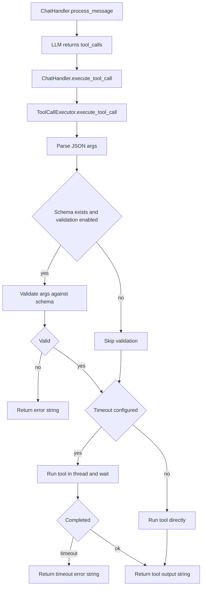

# Plan: Improve tool calling (schema validation, structured results, optional timeouts)

Scope: Problem #4 only. No code changes in this task; this plan is written for later implementation.

Hard requirements:

- Add:
  - (1) argument validation against tool schema
  - (2) structured tool result format
  - (3) optional timeouts
- Keep behavior compatible with existing tests and preserve the public surfaces of [`ChatHandler`](hardware/core/chat_handler.py:38) and [`ToolCallExecutor`](hardware/core/tool_execution.py:19).

## 0) Current behavior (baseline)

### Call flow

1. [`ChatHandler.process_message()`](hardware/core/chat_handler.py:357)
   - Requests tool schemas via [`ChatHandler._get_cached_tool_schemas()`](hardware/core/chat_handler.py:337)
   - Calls LLM via `llm.chat_with_tools(...)`.
   - If tool calls exist:
     - Iterates `tool_calls` and calls [`ChatHandler.execute_tool_call()`](hardware/core/chat_handler.py:425)
     - Appends tool results as `[{"content": result, "call_id": tool_call.get("id", "")}]`
     - Calls `llm.continue_conversation(tool_results, history, tools)`.

2. [`ChatHandler.execute_tool_call()`](hardware/core/chat_handler.py:425)
   - Delegates to [`ToolCallExecutor.execute_tool_call()`](hardware/core/tool_execution.py:26)

3. [`ToolCallExecutor.execute_tool_call()`](hardware/core/tool_execution.py:26)
   - Extracts `function.name` and JSON-decodes `function.arguments`.
   - Enforces `arguments` is a dict.
   - Resolves tool via [`ToolRegistry.get_tool()`](hardware/core/tool_execution.py:58)
   - Executes synchronously via `tool.execute(**arguments)`.
   - Error handling returns a *string* with specific messages:
     - missing function name
     - invalid JSON arguments
     - arguments must be an object
     - unknown tool
     - `ToolError`, `TypeError`, and generic `Exception`

### Observations and constraints

- Tool results are currently plain strings returned from [`ToolCallExecutor.execute_tool_call()`](hardware/core/tool_execution.py:26), then wrapped by the chat handler in a dict with `{content, call_id}`.
- Some tools may not match the assumed signature `execute(**kwargs)`; e.g. [`ResolveConflictTool.execute()`](hardware/tools/resolve_conflict_tool.py:28) is `async def execute(self, params: Dict[str, Any]) -> Dict[str, Any]`.
  - This implies either (a) this tool is unused in the current tool registry path, or (b) the codebase already has adapter logic elsewhere, or (c) tests do not cover this tool path.
  - The plan below avoids changing public surfaces, but calls out adapter needs.

## 1) Goals and non-goals

### Goals

1. Validate decoded tool arguments against the tool’s JSON schema before calling `execute`.
2. Capture tool execution results in a structured format with consistent fields (ok/error, tool name, call id, etc.).
3. Support optional timeouts for tool execution.
4. Preserve behavior compatibility:
   - Keep [`ToolCallExecutor.execute_tool_call()`](hardware/core/tool_execution.py:26) returning a string.
   - Keep [`ChatHandler.execute_tool_call()`](hardware/core/chat_handler.py:425) returning a string.
   - Do not break existing tests that assert exact error-string formatting.

### Non-goals

- No schema changes to LLM providers.
- No refactors of unrelated orchestration/memory/tts code.
- No design changes to how tools are registered in `ToolRegistry`, except adding optional metadata methods if needed.

## 2) Proposed design changes

### 2.1 Add argument validation against tool schema

#### Where validation occurs

- Perform validation inside [`ToolCallExecutor.execute_tool_call()`](hardware/core/tool_execution.py:26) after parsing JSON and before calling the tool.
  - This keeps all tool-call correctness in one place.
  - Maintains the same return type (string) while enabling richer internals.

#### How to obtain a tool schema

- Primary source: tool instance method (commonly present in this repo): `tool.schema_parameters()` as seen in [`ExecuteCodeTool.schema_parameters()`](hardware/tools/execute_code_tool.py:606).
- Fallback source: registry schema output (if a per-tool lookup exists). If only `ToolRegistry.get_tool_schemas()` exists, add an internal helper on executor to scan/cached map by tool name.

#### Validation approach (dependency-aware)

- Use a lightweight, local validator to avoid new dependencies. Rationale:
  - [`hardware/pyproject.toml`](hardware/pyproject.toml:1) currently does not include `jsonschema`.
  - Adding `jsonschema` is possible but increases surface area and potential test changes.

Minimum viable schema checks (compatible with the repo’s schemas):

- Validate that schema is a dict with `type: object`.
- Allowed keys from schema:
  - `properties` (dict)
  - `required` (list)
  - `additionalProperties` (bool or schema)
  - `enum`, `type`, `items`, `default` inside each property

Enforce:

- Required fields: if `required` lists `x`, ensure `arguments` contains `x`.
- Unknown keys:
  - If schema says `additionalProperties` is `False`, reject unknown keys.
  - Otherwise, allow.
- Basic type checking:
  - JSON types: string, number, integer, boolean, array, object, null.
  - Support `enum` checking.
  - For arrays: validate `items.type` if provided.

Defaults:

- If property declares `default` and arg missing, executor may inject default before calling tool.
  - This should be done carefully: only inject when tool signature can accept it and when it matches schema type.
  - If risk is high (tests might depend on absence), make default injection opt-in behind a feature flag.

Compatibility requirements:

- Validation failures must map to existing error-string formats.
  - New validation error strings should follow the pattern: `Error executing tool {name}: ...` as in [`ToolCallExecutor.execute_tool_call()`](hardware/core/tool_execution.py:53).
  - Avoid changing the prefix because tests may assert it.

Planned internal helper functions (new, internal):

- `parse_tool_arguments(raw_args: str) -> dict[str, Any] | error`
- `get_tool_schema(tool) -> dict[str, Any] | None`
- `validate_args_against_schema(args, schema) -> list[str]` (returns list of human-readable errors)

#### Edge cases

- Schema missing / tool has no schema:
  - Do not block execution; preserve current behavior.
  - Optionally log debug message.
- Schema uses constructs not supported by lightweight validator (`oneOf`, nested objects, patternProperties, etc.):
  - Soft-fail validation: warn and skip, or only apply supported checks.
  - Do not reject solely due to unsupported schema features.

### 2.2 Introduce structured tool execution result (internal-first)

#### Key compatibility constraint

- External/public API must remain string-returning.
  - [`ChatHandler.execute_tool_call()`](hardware/core/chat_handler.py:425) must still return a string.
  - [`ToolCallExecutor.execute_tool_call()`](hardware/core/tool_execution.py:26) must still return a string.

#### Proposal: implement a structured result object internally

Define an internal structured result model (dataclass or TypedDict), then adapt to string at the boundaries.

Suggested fields (minimum):

- `ok: bool`
- `tool: str`
- `call_id: str | None` (use `tool_call.get('id')`)
- `content: str` (human readable; what is returned today)
- `error_type: str | None` (eg ToolNotFound, ValidationError, Timeout)
- `error_details: dict[str, Any] | None` (machine-friendly details)
- `duration_ms: int | None`

#### Mapping rules back to current behavior

- On success: return exactly the tool’s string output (unchanged).
- On failure:
  - Return exactly the existing error-string patterns where they already exist.
  - For new categories (validation/timeout), match the same prefix:
    - `Error executing tool {name}: validation failed: ...`
    - `Error executing tool {name}: timed out after {timeout}s`

#### Why structured results still matter

Even if the public surface returns strings, structured results enable:

- Logging and metrics (duration, failure type)
- Providing richer tool result payloads to LLM providers in the future
- Optional future enhancement: include a JSON block inside `content` while keeping readable fallback

#### Where to store structured results

- In executor: keep structured result as local variable; return string.
- In chat handler: optionally enrich `tool_results` sent to the LLM.
  - Current shape in [`ChatHandler.process_message()`](hardware/core/chat_handler.py:396) is `{"content": str, "call_id": str}`.
  - To maintain compatibility with providers/tests, keep those keys, but allow additional keys only if provider ignores them.
  - Conservative approach: keep sending only `content` and `call_id` for now; structured data remains internal/log-only.

### 2.3 Add optional timeouts

#### Constraints

- Current tool execution in [`ToolCallExecutor.execute_tool_call()`](hardware/core/tool_execution.py:26) is synchronous.
- Some tools might be async (example: [`ResolveConflictTool.execute()`](hardware/tools/resolve_conflict_tool.py:28)).

#### Timeout strategy

Primary mechanism: `concurrent.futures.ThreadPoolExecutor` + `future.result(timeout=...)`

- Run the tool execution call in a worker thread.
- Wait for completion with optional timeout.
- On timeout:
  - Return a timeout error string (see mapping above).
  - Note: thread cannot be force-killed safely; mitigation is to:
    - Use daemon threads or let it finish in background.
    - Add warning logs and keep timeouts conservative.

Where timeout value comes from:

- Option A (preferred): Tool-level default timeout metadata (eg `tool.timeout_seconds` attribute or `tool.get_timeout_seconds()` method).
- Option B: Executor-level default (config/env) with per-tool overrides.
- Option C: Allow tool call args to include a special `__timeout` field.
  - Risky because it alters the tool schema; if used, it must be stripped before schema validation and calling execute.
  - Prefer tool/executor configured timeouts over model-provided timeouts.

Support for async tools:

- Detect if `tool.execute` is a coroutine function.
- If async:
  - Execute via `asyncio.run(...)` when no event loop is running.
  - If already in an event loop (possible in async contexts):
    - Use `asyncio.get_running_loop().create_task(...)` and `asyncio.wait_for(...)`.
  - Given the current stack, chat handler uses `asyncio.run(...)` at top-level, so executor is called in a running loop. However `ChatHandler.process_message()` is async and calls `self.execute_tool_call()` synchronously, so it is in an event loop.
  - Therefore, safest implementation is:
    - Keep executor sync, but for async tool functions, use `asyncio.get_running_loop()` and `run_until_complete` is not possible.
    - Preferred: keep sync executor but treat async tools as unsupported and return a clear error string unless a sync adapter exists.

Recommendation for compatibility: implement timeout for the existing sync execution path only, and explicitly document that async tools require an adapter layer (see below).

## 3) Backward compatibility plan

### 3.1 Preserve string outputs and error strings

- Do not change existing error messages emitted by [`ToolCallExecutor.execute_tool_call()`](hardware/core/tool_execution.py:41).
- Validation errors and timeouts must follow the established pattern.
- Avoid changing whitespace/casing of existing error strings.

### 3.2 Avoid changing `ChatHandler` and executor public signatures

- No signature changes to:
  - [`ChatHandler.execute_tool_call()`](hardware/core/chat_handler.py:425)
  - [`ToolCallExecutor.execute_tool_call()`](hardware/core/tool_execution.py:26)

### 3.3 Feature flags and incremental rollout

Add internal flags (config/env) so tests can opt-in later, or production can roll out gradually:

- `TOOL_ARG_VALIDATION_ENABLED` default False initially (or True if tests tolerate).
- `TOOL_RESULT_STRUCTURED_LOGGING_ENABLED` default True (log-only).
- `TOOL_EXECUTION_TIMEOUT_SECONDS_DEFAULT` default None/0 (disabled).

Implementation can start with flags defaulting to “off” to guarantee compatibility, then enable in a follow-up once tests are updated.

## 4) Implementation steps (for later Code mode)

### Step 1: Inventory tool schema formats

- Scan the tools in `hardware/tools/` to confirm schema style:
  - `schema_parameters()` presence
  - shape of schema dictionaries
- Confirm how schemas are published via registry and used by LLM provider.

Relevant files:

- [`hardware/core/tool_execution.py`](hardware/core/tool_execution.py:1)
- [`hardware/core/chat_handler.py`](hardware/core/chat_handler.py:1)
- [`hardware/tools/execute_code_tool.py`](hardware/tools/execute_code_tool.py:606)

### Step 2: Add internal structured result type

- Create an internal dataclass in [`hardware/core/tool_execution.py`](hardware/core/tool_execution.py:1) (or a new internal module if preferred).
- Refactor executor internals to build `ToolExecutionResult` but still `return result.content`.

### Step 3: Implement schema validation helper

- Add internal validation helper functions in [`hardware/core/tool_execution.py`](hardware/core/tool_execution.py:1) or a small new module (eg `hardware/core/tool_validation.py`).
- Integrate validation into executor before calling tool.
- Ensure validation errors map to string patterns.

### Step 4: Implement optional timeout wrapper

- Add an internal `_run_with_timeout(callable, timeout)` helper.
- Apply only when timeout is configured.
- On timeout, return mapped error string and record structured fields.

### Step 5: Update logging to use structured results

- Log `tool`, `ok`, `duration_ms`, `error_type` in executor logger.
- Ensure logs don’t affect tests (avoid printing to stdout).

### Step 6: Add/adjust tests (if applicable)

- Add unit tests for:
  - validation failures
  - timeout behavior
  - successful execution unaffected
- Keep existing tests stable; if tests assert tool results content, ensure identical strings.

## 5) Adapter note: async tools and nonstandard execute signatures

The current executor calls `tool.execute(**arguments)` (kwargs). Tools like [`ResolveConflictTool.execute()`](hardware/tools/resolve_conflict_tool.py:28) are async and accept a single `params` dict.

Options (pick one later):

- A) Registry-level adapter: registry returns a wrapped tool object whose `execute(**kwargs)` conforms.
- B) Executor-level adapter:
  - If `tool.execute` expects a `params` arg, call `tool.execute(arguments)`.
  - If coroutine, run appropriately.
- C) Standardize all tools to `execute(**kwargs)` and sync.

For this problem’s scope, prefer A or B but implement behind a compatibility gate:

- If detected signature mismatch, return the existing TypeError formatting (`Error executing tool {name}: {exc}`) to avoid behavioral changes.

## 6) Mermaid: execution flow with validation + timeouts

## 7) Acceptance criteria

- Tool-call argument validation rejects malformed calls consistently and safely, without breaking existing error-string expectations.
- Tool results are internally structured (for logging/metrics), but outward behavior remains unchanged.
- Optional timeouts can be enabled without altering default behavior.
- [`ChatHandler`](hardware/core/chat_handler.py:38) and [`ToolCallExecutor`](hardware/core/tool_execution.py:19) public signatures remain unchanged.
